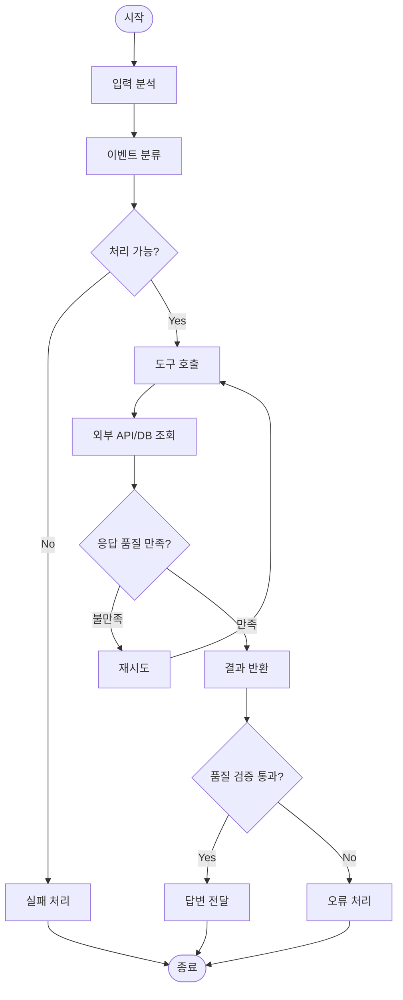
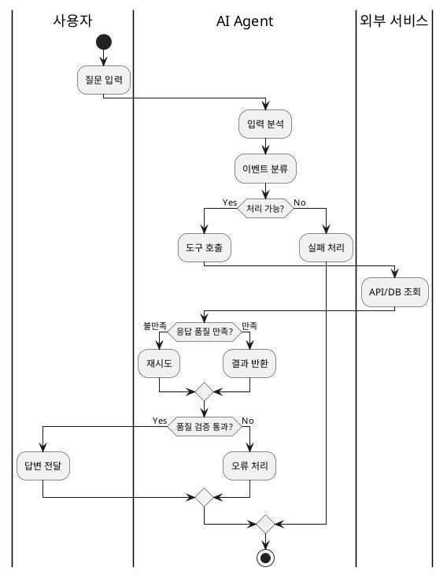

# 액티비티 다이어그램: 어떤 흐름으로 처리되는가

_written by Claude-Code, ChatGPT_

[[uml-use-case-for-ai-agent|2편: 유스케이스 다이어그램]]에서는 만들려는 시스템의 범위와 외부 세계와의 접점을 탐구했다. 액터를 찾고 목표를 정리했다면, 이번에 던져야 할 다음 질문이 있다.

**그 목표는 어떤 흐름으로 달성되는가?**

액티비티 다이어그램은 이 질문을 탐구하는 도구다. 유스케이스가 "무엇을 할 것인가"를 묻는다면, 액티비티는 "어떤 순서로, 어떤 조건에서 처리되는가"를 묻는다.

## 왜 흐름을 먼저 그려야 하는가

유스케이스 다이어그램으로 "답변 받기"라는 목표를 정리했다고 하자. AI Agent에게 곧바로 구현을 요청하면 어떻게 될까?

> 고객 질문을 받아서 지식 베이스를 검색하고 답변을 돌려줘.

Agent는 코드를 만들어 낸다. 하지만 다음 질문들에 대한 답이 없다.

- 질문 의도를 먼저 분류해야 하는가, 아니면 곧바로 검색해야 하는가?
- 검색 결과가 없거나 신뢰도가 낮으면 어떻게 처리하는가?
- 재시도는 몇 번까지 하는가?
- 오류 상황에서 사용자에게 어떤 메시지를 돌려주는가?

이런 질문들은 "무엇을 만들어야 하는가"가 아니라 "어떤 조건에서 어떻게 처리하는가"의 영역이다. 액티비티 다이어그램은 이 처리 흐름을 시각적으로 고정한다.

## 액티비티 다이어그램이 보여주는 것

액티비티 다이어그램은 시스템이나 업무가 처리되는 순서를 한눈에 볼 수 있게 해준다. 유스케이스가 범위의 지도라면, 액티비티는 흐름의 지도다.

| 구성 요소 | AI Agent와 함께 개발할 때의 의미 |
|-----------|--------------------------------|
| 시작 노드 | 처리가 시작되는 진입점 |
| 액션 | Agent가 수행하는 단일 처리 단계 |
| 결정 노드 | 조건에 따라 분기하는 지점 |
| 병렬/합류 | 동시에 처리되거나 합쳐지는 흐름 |
| 수영 레인 | 사용자, AI Agent, 외부 서비스의 책임 영역 구분 |
| 종료 노드 | 처리가 끝나는 시점 |

다이어그램에서 눈에 띄는 것은 결정 노드(다이아몬드)다. 어떤 조건에서 흐름이 달라지는지가 그 안에 들어간다. 자연어 요구사항에서 쉽게 빠지는 조건 분기와 예외 처리가 결정 노드를 그리는 순간 드러난다.

## 예시: 고객 질문에 답변하는 AI Agent

2편과 같은 예시를 이어서 보자. "답변 받기" 유스케이스 하나를 액티비티 다이어그램으로 펼치면 어떻게 되는가.

처리 흐름은 세 개의 수영 레인에 나뉜다.

| 레인 | 담당 |
|------|------|
| 사용자 | 질문을 입력하고 결과를 받는다 |
| AI Agent | 의도를 분류하고 도구를 호출해 답변을 생성한다 |
| 외부 서비스 | 지식 베이스, 외부 API, DB가 응답을 반환한다 |

흐름을 단계별로 보면 다음과 같다.

| 단계 | 처리 내용 | 분기 조건 |
|------|-----------|-----------|
| 입력 분석 | 사용자 질문에서 의도와 맥락을 추출한다 | — |
| 이벤트 분류 | 처리 유형을 판단한다 | — |
| 처리 가능 여부 확인 | Agent가 현재 컨텍스트에서 답할 수 있는지 판단한다 | 가능: 도구 호출 / 불가: 실패 처리 |
| 도구 호출 | 외부 API 또는 지식 베이스를 조회한다 | — |
| 응답 품질 확인 | 검색 결과가 기준을 충족하는지 판단한다 | 만족: 결과 반환 / 불만족: 재시도 |
| 재시도 | 전략을 바꿔 다시 도구를 호출한다 | 횟수 초과: 오류 처리 |
| 품질 검증 | 생성된 답변이 최소 기준을 통과하는지 확인한다 | 통과: 답변 전달 / 실패: 오류 처리 |
| 답변 전달 | 검증된 답변을 사용자에게 반환한다 | — |

이 흐름을 그리는 과정에서 자연어 요구사항에 보이지 않던 것들이 드러난다.

- 재시도는 몇 번까지 허용하는가?
- 처리 불가 상황은 어떤 응답을 사용자에게 보내는가?
- 품질 검증의 기준은 무엇인가?

이 질문들은 액티비티를 그리기 전에는 보이지 않는 경우가 많다.

## 결정 노드를 어떻게 다루는가

결정 노드는 액티비티 다이어그램에서 가장 많은 정보가 압축되는 지점이다. 조건 하나가 시스템의 행동을 완전히 바꾼다.

AI Agent와 함께 개발할 때 결정 노드가 중요한 이유가 있다. Agent는 조건이 명시되지 않으면 임의로 판단한다. "검색 결과가 없으면 어떻게 할까?"에 대한 답이 없으면 Agent가 선택하게 된다. 그 선택이 의도와 다를 때 수정 사이클이 시작된다.

결정 노드를 그릴 때 함께 정리해야 할 것들이 있다.

- 어떤 조건을 평가하는가?
- 조건이 참일 때의 흐름
- 조건이 거짓일 때의 흐름
- 예외 상황이 있는가?

이 네 가지가 결정 노드 하나를 완성한다. 모두 정해지지 않은 상태에서 구현으로 내려가면 Agent가 채워야 하는 빈칸이 생긴다.

## 수영 레인이 드러내는 것

수영 레인은 처리 단계를 "누가 처리하는가"로 구분한다. 레인이 나뉘는 순간 책임 경계가 보인다.

고객지원 서비스 예시에서 수영 레인을 구분하면 다음 질문들이 생긴다.

- 의도 분류는 사용자 입력을 받자마자 시작하는가, 아니면 먼저 인증을 거치는가?
- 도구 호출은 AI Agent가 직접 하는가, 아니면 오케스트레이터 레이어가 따로 있는가?
- 외부 서비스 응답이 느릴 때 타임아웃은 어느 레인이 처리하는가?

이 질문들은 시퀀스 다이어그램을 그리기 전에 먼저 정리되어야 할 내용이다. 수영 레인이 그 정리를 도와준다.

## AI Agent에게 전달할 때

이미지 다이어그램은 팀 내 검토에 유용하다. AI Agent에게 처리 흐름을 전달할 때는 Mermaid 같은 텍스트 표기가 더 다루기 쉽다.

단순한 흐름은 Mermaid flowchart로 시작할 수 있다.

수영 레인이 필요한 복잡한 흐름은 PlantUML이 더 표현력이 높다.

이 코드 하나가 처리 흐름의 설계를 AI Agent에게 전달하는 구체적인 맥락이 된다. "재시도는 품질이 불만족일 때만 발생한다", "품질 검증은 결과 반환 이후에 이루어진다"는 것이 코드에 이미 담겨 있다.

## AI Agent와 함께 개발할 때 주는 힌트

액티비티 다이어그램을 그리면서 얻는 것은 다이어그램 자체만이 아니다.

첫째, 재시도 전략이 보인다.

재시도 루프가 다이어그램에 그려지는 순간, 몇 번까지 허용하는가, 재시도 간격은 어떻게 되는가, 최종 실패 시 어떤 흐름으로 빠지는가 같은 질문이 생긴다. 구현에서 발견하면 이미 늦다.

둘째, 병렬 처리 가능성이 드러난다.

병렬 처리 기호를 쓰다 보면 "도구 호출 A와 B는 사실 순서 의존성이 없다"는 것을 알게 되는 경우가 있다. 순서대로 구현할 것을 병렬화하면 응답 속도가 달라진다.

셋째, 다음 다이어그램의 입력이 된다.

흐름 안에서 AI Agent와 외부 서비스 사이의 교환을 그리다 보면, 어떤 요청을 주고 어떤 응답을 받는지가 궁금해진다. 이 질문이 시퀀스 다이어그램으로 이어진다.

## 간단한 작성 순서

처음부터 완성된 다이어그램을 그리려고 할 필요는 없다.

1. 시작 노드에서 종료 노드까지 주요 단계를 순서대로 나열한다.
2. 조건 분기가 필요한 지점에 결정 노드(다이아몬드)를 추가한다.
3. 각 조건에서 분기되는 흐름을 이어 그린다.
4. 예외, 오류, 재시도 흐름을 추가한다.
5. 처리 주체가 여럿이라면 수영 레인으로 구분한다.

결정 노드를 만날 때마다 "이 조건이 참이면 어떻게 하고, 거짓이면 어떻게 하는가?"를 먼저 정하는 것이 핵심이다. 이 과정이 자연어 요구사항 속의 빈칸을 채운다.

## 이번 편의 정리

액티비티 다이어그램은 AI Agent와 함께 시스템이나 서비스를 개발할 때 "어떤 흐름으로 처리되는가"를 탐구하는 도구다.

- 처리 단계를 순서대로 나열하면 빠진 단계가 보인다.
- 결정 노드를 그리면 조건 분기와 예외 처리가 드러난다.
- 수영 레인을 추가하면 책임 경계가 명확해진다.
- 재시도 루프를 그리면 종료 조건이 정해져야 한다는 것이 보인다.

유스케이스가 만들 것의 범위를 정한다면, 액티비티는 그것이 어떻게 처리되는지를 드러낸다. 이 흐름이 정리된 상태에서 AI Agent에게 구현을 요청하면, Agent가 채워야 하는 빈칸이 줄어든다.

---

## 시리즈 네비게이션

- **이전**: [[uml-use-case-for-ai-agent|2편 - 유스케이스 다이어그램: 무엇을 할 것인가]]
- **현재**: 3편 - 액티비티 다이어그램 (어떤 흐름으로 처리되는가)
- **다음**: 4편 - 시퀀스 다이어그램 (누가 누구와 상호작용하는가)

## 연관 포스트

- [[ai-agent-document-types|AI Agent 소통 효율을 높이는 6가지 문서 유형]]
- [[ai-agent-development-principles|AI Agent 개발 원칙]]
