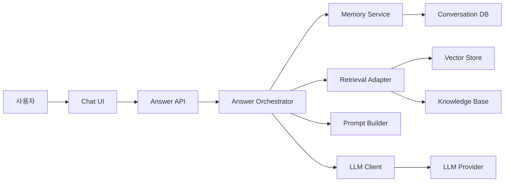

# 컴포넌트 다이어그램: 시스템은 무엇으로 구성되는가

_written by Codex, ChatGPT_

[[uml-sequence-for-ai-agent|4편: 시퀀스 다이어그램]]에서는 사용자 요청이 처리되는 동안 누가 누구에게 무엇을 요청하는지 살펴봤다. 메시지 흐름을 시간 순서대로 펼치면 "Agent가 처리한다"는 말 안에 숨어 있던 호출 관계가 드러난다.

그 다음에는 더 구조적인 질문이 남는다.

**그 책임들은 어떤 시스템 구성 요소 위에 놓이는가?**

컴포넌트 다이어그램은 이 질문을 탐구하는 도구다. 시퀀스 다이어그램이 실행 중 오가는 메시지를 보여준다면, 컴포넌트 다이어그램은 그 메시지를 담당할 구성 요소와 의존성을 보여준다.

여기서 말하는 시스템은 AI Agent 자체가 아니다. 이 글의 초점은 **AI Agent와 함께 개발하려는 시스템이나 서비스를 어떤 구성 요소로 나누면 요구사항과 설계를 더 명확히 전달할 수 있는가**에 있다.

## 왜 컴포넌트 다이어그램인가

AI Agent와 함께 개발하다 보면 자연어 요구사항은 보통 이렇게 시작한다.

> 사용자가 질문하면 관련 문서를 찾아서 답변을 생성하는 기능을 만들어줘.

겉으로는 충분해 보인다. 하지만 구현으로 내려가면 금방 질문이 늘어난다.

- 사용자 입력을 받는 부분과 답변 생성 로직은 같은 컴포넌트인가?
- 검색이 필요한지 판단하는 책임은 어디에 있는가?
- 실제 검색은 누가 수행하는가? Agent인가, 검색 도구인가, 별도 어댑터인가?
- LLM 호출은 답변 흐름을 조율하는 컴포넌트가 직접 하는가?
- 대화 이력 저장과 문서 검색은 같은 저장소 책임인가?
- 외부 API나 Vector DB를 바꾸면 어느 부분을 수정해야 하는가?

이 질문들은 "무엇을 만들 것인가"도 아니고, "누가 누구에게 요청하는가"만으로도 부족하다. **책임이 어떤 구성 요소에 배치되는가**를 봐야 답할 수 있다.

컴포넌트 다이어그램은 자연어에서 "시스템이 한다", "Agent가 한다"로 뭉뚱그려진 일을 여러 책임 단위로 나눈다. 그 결과 AI Agent에게 구현을 맡길 때도 작업 범위가 더 분명해진다.

## 컴포넌트 다이어그램이 보여주는 것

컴포넌트 다이어그램은 시스템을 이루는 논리적 구성 단위와 그 단위 사이의 계약을 보여준다.

| 구성 요소 | AI Agent와 함께 개발할 때의 의미 |
|-----------|--------------------------------|
| 컴포넌트 | 책임이 명확한 구현 단위. 서비스, 모듈, 어댑터, 라이브러리 등이 될 수 있다 |
| 인터페이스 | 컴포넌트가 제공하거나 필요로 하는 기능 계약 |
| 의존성 | 한 컴포넌트가 다른 컴포넌트의 기능이나 데이터에 기대는 관계 |
| 포트 | 외부와 통신하는 접점. API endpoint, queue topic, 함수 경계처럼 표현할 수 있다 |
| 패키지 | 관련된 컴포넌트들을 묶어 더 큰 구조로 설명하는 단위 |


이 이미지의 중심에는 고객지원 답변 기능을 구현 책임 단위로 나눈 예시가 있다. 여기서 중요한 것은 "AI Agent 시스템을 어떻게 만들 것인가"가 아니라, AI Agent에게 개발을 맡기기 전에 어떤 책임을 어떤 컴포넌트로 분리할지 보는 것이다.

## 예시: 고객지원 답변 기능을 나누어 보기

앞선 편들과 같은 고객지원 서비스 예시를 이어서 보자. 사용자가 질문을 입력하면 관련 문서를 찾고 답변을 생성해서 반환한다.

자연어로는 다음처럼 짧게 표현된다.

> 고객 질문을 받아서 관련 문서를 찾고 답변을 생성해줘.

하지만 이 문장 안에는 여러 책임이 섞여 있다.

| 자연어 표현 | 숨어 있는 책임 |
|------------|----------------|
| 질문을 받는다 | UI 입력 처리, 요청 검증, 인증 정보 전달 |
| 관련 문서를 찾는다 | 검색 필요 여부 판단, 검색 쿼리 구성, Vector DB 조회 |
| 답변을 생성한다 | 프롬프트 구성, LLM 호출, 응답 정제 |
| 맥락을 반영한다 | 대화 이력 조회, 사용자 정보 조회, 저장 정책 적용 |
| 결과를 반환한다 | 응답 형식 변환, 오류 메시지 처리, 화면 표시 |

시퀀스 다이어그램에서는 이 책임들이 메시지 흐름으로 보였다. 컴포넌트 다이어그램에서는 이 책임들이 어떤 구현 단위에 배치되는지가 보인다.

예를 들어 다음처럼 나눌 수 있다.

| 컴포넌트 | 맡는 책임 |
|----------|----------|
| Chat UI | 사용자 입력 수집, 답변 표시 |
| Answer API | 요청 검증, 인증 정보 확인, 응답 형식 변환 |
| Answer Orchestrator | 전체 흐름 조율, 어떤 컴포넌트를 호출할지 결정 |
| Retrieval Adapter | 검색 요청을 받아 Vector Store나 지식 베이스 호출 |
| Prompt Builder | 검색 결과와 맥락을 LLM 입력 형식으로 구성 |
| LLM Client | LLM Provider 호출, 재시도와 오류 처리 |
| Memory Service | 대화 이력 저장과 조회 |

이렇게 나누면 AI Agent에게 전달하는 개발 맥락도 달라진다. "답변 기능을 만들어줘"가 아니라 "검색 책임은 Retrieval Adapter가 맡고, 답변 흐름 조율은 Answer Orchestrator가 맡는다"라고 설명할 수 있다.

## "Agent가 한다"를 그대로 두지 않기

AI Agent와 함께 개발할 때 가장 자주 흐려지는 표현이 "Agent가 한다"다.

Agent는 판단한다. 어떤 정보가 필요한지, 다음 단계가 무엇인지, 어떤 도구를 사용할지 결정한다.

반면 검색 어댑터는 검색한다. LLM 클라이언트는 모델을 호출한다. 메모리 서비스는 대화 이력을 저장하고 조회한다. 이 책임들을 모두 Agent라는 한 단어에 넣으면 구현 지시가 모호해진다.

> Agent가 지식 베이스를 검색해서 답변한다.

이 문장은 짧지만, 실제 구현에서는 다음 질문을 남긴다.

- Agent가 Vector DB 클라이언트를 직접 알고 있어야 하는가?
- 검색 결과 정렬은 Agent가 하는가, 검색 컴포넌트가 하는가?
- LLM Provider 교체는 어느 컴포넌트에 영향을 주는가?
- 대화 이력 저장 실패는 답변 생성 실패로 볼 것인가?

컴포넌트 다이어그램은 이 질문을 숨기지 못하게 만든다. 박스를 나누는 순간 각 박스가 무엇을 알고 무엇을 몰라야 하는지 결정해야 하기 때문이다.

## Mermaid로 그려본 컴포넌트 구조

처음부터 완벽한 UML 표기법으로 그릴 필요는 없다. AI Agent에게 전달할 개발 맥락이라면 Mermaid로도 충분히 시작할 수 있다.



이 다이어그램은 코드 구조를 확정하는 최종 설계도가 아니다. 대신 구현 전에 다음을 확인하게 해준다.

- Answer Orchestrator는 흐름을 조율하지만 Vector Store를 직접 다루지 않는다.
- Retrieval Adapter는 검색 책임을 맡고, 답변 생성에는 관여하지 않는다.
- LLM Client는 Provider 호출을 감싸고, 질문 의도 판단은 하지 않는다.
- Memory Service는 대화 이력을 관리하고, 문서 검색 저장소와 분리된다.

이 정도만 있어도 AI Agent는 어느 컴포넌트에 어떤 책임을 넣어야 하는지 덜 추측하게 된다.

## 컴포넌트 경계에서 자주 묻는 질문

컴포넌트 다이어그램을 그릴 때 중요한 것은 박스의 개수가 아니다. 경계를 나누면서 생기는 질문이다.

### 책임에 대한 질문

- 이 컴포넌트는 한 문장으로 설명되는가?
- 이 컴포넌트가 하지 말아야 할 일은 무엇인가?
- 이 책임을 다른 컴포넌트로 옮기면 무엇이 단순해지는가?
- 이 컴포넌트만 따로 테스트할 수 있는가?

### 인터페이스에 대한 질문

- 입력과 출력은 무엇인가?
- 오류는 어떤 형식으로 전달되는가?
- 외부 API 응답을 그대로 넘기는가, 내부 형식으로 변환하는가?
- 비동기 호출, 타임아웃, 재시도 정책은 어디에 있는가?

### 의존성에 대한 질문

- 의존성 방향이 한쪽으로 흐르는가?
- 순환 의존성이 생기지는 않는가?
- 교체 가능성이 높은 요소는 인터페이스 뒤에 있는가?
- 테스트에서 외부 시스템을 쉽게 대체할 수 있는가?

이 질문에 답하다 보면 자연스럽게 AI Agent에게 맡길 수 있는 작업 단위도 보인다. 한 컴포넌트의 책임과 인터페이스가 명확하다면, 그 컴포넌트는 독립적인 구현 요청으로 분리하기 쉽다.

## AI Agent에게 전달할 때

이미지 다이어그램은 사람 사이의 검토에 좋다. 하지만 AI Agent에게 구현 맥락을 전달할 때는 텍스트 기반 다이어그램과 짧은 책임 설명을 함께 넘기는 편이 안정적이다.

예를 들어 `Retrieval Adapter`를 구현하게 하고 싶다면 다음 정도면 충분히 시작할 수 있다.

```text
컴포넌트: Retrieval Adapter

책임:
- 검색 요청을 받아 Vector Store와 Knowledge Base를 조회한다.
- 검색 결과를 내부 DocumentSnippet 형식으로 변환한다.
- 검색 결과가 없으면 빈 배열을 반환한다.

하지 않는 일:
- 답변을 생성하지 않는다.
- LLM을 호출하지 않는다.
- 대화 이력을 저장하지 않는다.

입력:
- query
- tenantId
- topK

출력:
- DocumentSnippet[]
```

이 지시는 세부 구현을 모두 지정하지 않는다. 대신 책임의 경계를 정한다. AI Agent는 그 경계 안에서 구현 세부를 채울 수 있고, 사람은 결과를 리뷰할 때 "이 컴포넌트가 자기 책임을 넘었는가?"를 기준으로 볼 수 있다.

## 작성할 때 자주 생기는 실수

컴포넌트 다이어그램은 구조를 보여주는 도구다. 그래서 너무 빨리 코드 수준으로 내려가면 오히려 읽기 어려워진다.

첫째, 클래스나 함수 목록으로 만들지 않는다.

`parseRequest()`, `validateInput()`, `mapResponse()` 같은 함수들을 모두 컴포넌트로 올리면 다이어그램이 코드 목차가 된다. 처음에는 책임 단위가 더 중요하다.

둘째, "Agent" 박스를 너무 크게 두지 않는다.

Agent 박스 하나에 판단, 검색, 저장, LLM 호출이 모두 들어가면 다이어그램이 자연어 지시와 다르지 않다. Agent가 판단하는 책임과 도구가 실행하는 책임을 나누어 봐야 한다.

셋째, 외부 시스템과 내부 컴포넌트를 섞지 않는다.

Vector DB, LLM Provider, CRM API 같은 외부 의존성은 내부 책임 단위와 다르게 다루어야 한다. 외부 시스템을 그대로 직접 호출하게 할지, 어댑터를 둘지 결정해야 변경 범위가 보인다.

넷째, 인터페이스를 생략하지 않는다.

박스만 있고 연결선의 의미가 없으면 구현 단계에서 다시 모호해진다. 최소한 "무엇을 요청하고 무엇을 반환하는가"는 함께 적어야 한다.

## 간단한 작성 순서

처음부터 완성된 컴포넌트 다이어그램을 만들 필요는 없다. 다음 순서로 충분하다.

1. 시퀀스 다이어그램에서 반복해서 등장한 참여자와 책임을 적는다.
2. "Agent가 한다"로 표현된 부분을 판단, 실행, 저장, 호출 책임으로 나누어 본다.
3. 각 책임을 컴포넌트 후보로 적는다.
4. 각 컴포넌트가 제공하는 인터페이스와 필요한 인터페이스를 적는다.
5. 외부 시스템과 내부 컴포넌트를 구분한다.
6. 의존성 방향이 순환하지 않는지 확인한다.
7. AI Agent에게 독립적으로 맡길 수 있는 컴포넌트부터 구현 단위로 분리한다.

작성 중에는 다음 질문을 계속 확인한다.

- 이 컴포넌트는 어떤 책임을 맡는가?
- 이 컴포넌트가 몰라도 되는 것은 무엇인가?
- 이 컴포넌트를 바꾸면 어느 부분이 영향을 받는가?
- 이 컴포넌트만 테스트할 수 있는가?
- AI Agent에게 이 컴포넌트만 설명해도 구현을 시작할 수 있는가?

## 이번 편의 정리

컴포넌트 다이어그램은 AI Agent와 함께 시스템이나 서비스를 개발할 때 "시스템은 무엇으로 구성되는가"를 탐구하는 도구다.

- 컴포넌트를 나누면 자연어 지시에 숨어 있던 책임이 보인다.
- 인터페이스를 적으면 컴포넌트 사이의 계약이 명확해진다.
- 의존성을 연결하면 변경과 테스트의 영향 범위가 드러난다.
- 외부 시스템을 분리하면 교체 가능성과 장애 대응 지점이 보인다.

유스케이스가 만들 것의 범위를 정하고, 액티비티가 처리 흐름을 펼치고, 시퀀스가 참여자 사이의 대화를 정리했다면, 컴포넌트 다이어그램은 그 책임들을 구현 단위로 배치한다. 이 구조가 있으면 AI Agent에게 코드를 맡길 때 Agent가 책임 경계를 덜 추측한다.

이것이 AI Agent 활용 개발에서 컴포넌트 다이어그램이 해결하는 문제다. AI Agent 시스템을 만드는 것이 아니라, AI Agent와 함께 개발할 시스템의 구성 요소와 책임 경계를 더 명확히 설명하는 것이다.

---

## 시리즈 네비게이션

- **이전**: [[uml-sequence-for-ai-agent|4편 - 시퀀스 다이어그램: 누가 누구와 상호작용하는가]]
- **현재**: 5편 - 컴포넌트 다이어그램 (시스템은 무엇으로 구성되는가)

## 연관 포스트

- [[ai-agent-document-types|AI Agent 소통 효율을 높이는 6가지 문서 유형]]
- [[ai-agent-development-principles|AI Agent 개발 원칙]]
