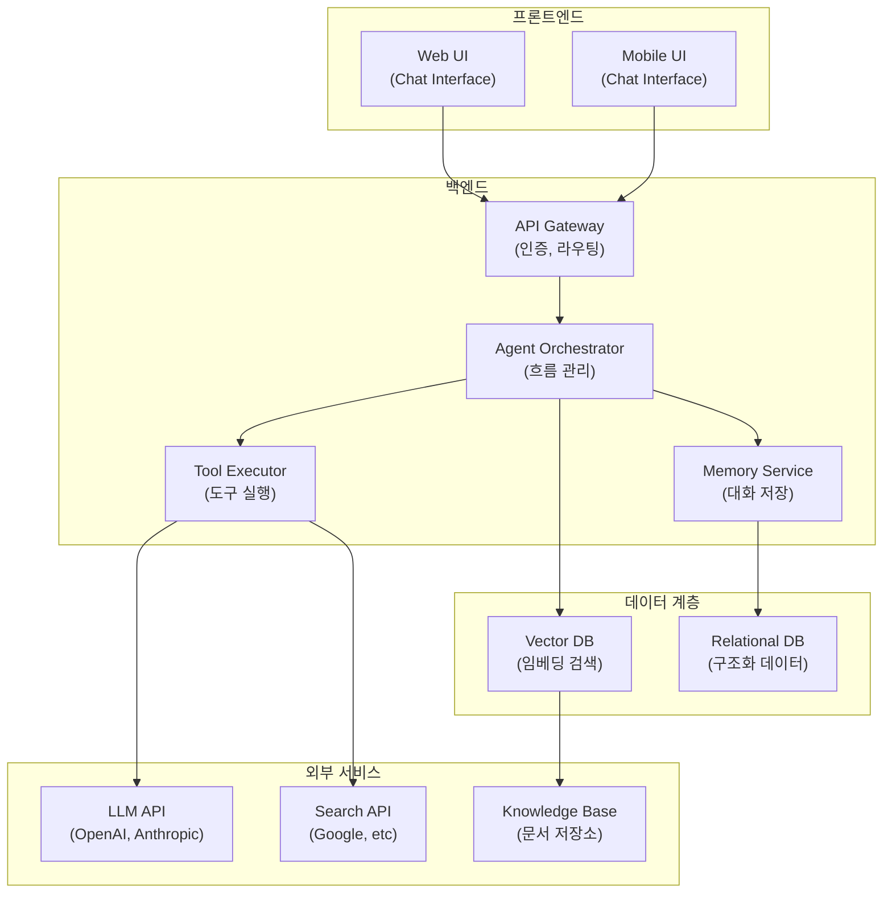

# 컴포넌트 다이어그램: 시스템은 무엇으로 구성되는가

_written by Claude-Code,ChatGPT_

[[uml-sequence-for-ai-agent|4편: 시퀀스 다이어그램]]에서는 참여자들 사이의 메시지 흐름을 살펴봤다. 사용자가 질문을 입력하면 Agent가 어떤 순서로 누구와 만나는지 보였다.

그 다음에는 더 근본적인 질문이 남는다.

**그 참여자들은 실제로 어떤 구성 요소들로 이루어져 있는가?**

컴포넌트 다이어그램은 이 질문을 탐구하는 도구다. 시퀀스 다이어그램이 런타임의 상호작용을 보여준다면, 컴포넌트 다이어그램은 시스템 아키텍처의 정적 구조를 보여준다. 어떤 모듈이나 서비스들이 존재하고, 그들이 어떻게 조직되며, 어떤 인터페이스로 서로 통신하는지를 명시한다.

## 왜 컴포넌트를 먼저 정의하는가

AI Agent 기반 시스템을 개발하다 보면 자연어 요구사항은 보통 이렇게 시작한다.

> 사용자가 질문하면 Agent가 지식 베이스에서 정보를 찾아서 답변을 생성해줘.

겉으로는 충분해 보인다. 하지만 구현으로 내려가면 금방 질문이 늘어난다.

- Agent가 직접 지식 베이스를 검색하는가, 아니면 검색 도구를 호출하는가?
- "정보를 찾는다"는 것이 Vector DB 검색인가, 키워드 검색인가, 아니면 둘 다인가?
- 검색 결과가 여러 개면 Agent가 필터링하는가, 아니면 모두 전달하는가?
- 메모리(대화 이력)는 검색 전에 조회하는가, 답변 생성 후에 저장하는가?
- LLM API 호출은 누가 담당하는가? Agent 직접인가, 아니면 별도 컴포넌트인가?

3편 액티비티와 4편 시퀀스에서는 이미 처리 흐름과 참여자 간 상호작용을 다뤘다. 하지만 여기서는 더 근본적인 질문이 남는다.

**"Agent"라는 한 단어로 뭉뚱그려진 역할들이 실제로는 어떤 별개의 컴포넌트로 분리되어야 하는가?**

자연어에서는 "Agent가 xxx를 한다"고 하지만, 실제 구현에서 "Agent"는 여러 책임을 담당할 수 없다. 의사결정은 누가? 도구 실행은? 데이터 저장은? 각각이 분명한 경계를 가진 컴포넌트가 되어야 한다.

컴포넌트 다이어그램은 이 경계를 명시한다. 자연어 요구사항에 숨어있는 여러 책임들을 구별하고, 각각이 어떤 컴포넌트가 되어야 하는지 정의하게 해준다. 그 결과 AI Agent와의 지시가 명확해진다. "Agent를 만들어줘"가 아니라 "Agent Orchestrator, Tool Executor, Memory Service는 이렇게 나눠서 구현해"라고 할 수 있게 된다.

## 컴포넌트 다이어그램이 보여주는 것

컴포넌트 다이어그램은 시스템을 구성하는 물리적 또는 논리적 단위들을 보여준다.

| 구성 요소 | AI Agent와 함께 개발할 때의 의미 |
|-----------|--------------------------------|
| 컴포넌트 | 책임이 명확한 논리적 단위 (서비스, 모듈, 라이브러리) |
| 인터페이스 | 컴포넌트가 제공하거나 필요로 하는 계약 |
| 의존성 | 컴포넌트 간의 호출 관계 |
| 포트 | 컴포넌트가 외부와 통신하는 접점 |
| 커넥터 | 컴포넌트를 연결하는 통신 경로 |
| 패키지 | 관련된 컴포넌트들을 그룹화한 단위 |


이 이미지의 중심에는 AI Agent 시스템의 전체 구조가 있다. 프론트엔드(Web, Mobile)부터 백엔드(API Gateway, Agent Orchestrator, Tool Executor), 메모리 계층(Memory Service, Vector DB), 그리고 외부 시스템들(LLM API, Search API, 데이터베이스)까지 각 계층의 컴포넌트들이 어떻게 조직되는지 보여준다.

## 예시: 고객 질문에 답변하는 AI Agent 시스템

앞선 편들과 같은 고객지원 시스템을 이번엔 아키텍처 관점에서 보자. 자연어 요구사항부터 시작해보자.

> 고객이 질문을 입력하면 Agent가 지식 베이스에서 관련 문서를 찾고 LLM으로 답변을 생성해서 반환해줘.

이 문장을 구현하려면 AI Agent와 함께 다음 질문들을 풀어야 한다.

### Agent라는 한 단어 뒤의 여러 역할들

"Agent가 지식 베이스에서 찾고 답변을 생성한다"고 했을 때:

- **누가** 사용자 입력을 받아서 처리를 시작하는가? (Chat UI? API Gateway? 아니면 Agent 자신?)
- **누가** 지식 베이스 검색의 필요성을 판단하는가? (Agent의 판단? 고정 로직?)
- **누가** 지식 베이스를 실제로 검색하는가? (Agent? 검색 전담 도구? Vector DB?)
- **누가** 검색 결과를 LLM으로 보낼 때 형식을 정하는가?
- **누가** LLM의 응답을 저장하는가? (메모리 서비스?)
- **누가** 최종 답변을 사용자에게 반환하는가?

자연어에서는 이 모든 것이 "Agent"로 표현된다. 하지만 실제 구현에서 하나의 Agent가 이 모든 책임을 질 수는 없다. 각각이 명확한 책임을 가진 컴포넌트가 되어야 한다.

### 자연어 표현 vs 컴포넌트 분리

| 자연어 표현 | 숨어있는 실제 역할들 | 담당 컴포넌트 |
|------------|------------------|-------------|
| "Agent가 질문을 받는다" | 입력 수집, 인증, 세션 관리 | Chat UI, API Gateway |
| "Agent가 지식 베이스를 찾는다" | 검색 의도 판단, 쿼리 구성, 실제 검색 | Agent Orchestrator, Tool Executor, Vector DB |
| "답변을 생성한다" | LLM 호출, 프롬프트 구성, 응답 정제 | Agent Orchestrator, LLM API |
| "답변을 반환한다" | 결과 저장, 형식 변환, 전송 | Memory Service, Chat UI |

이렇게 분리하면 각 컴포넌트의 책임이 명확해진다.

### 실제 컴포넌트 구조

이 시스템을 아키텍처 관점에서 나누면 다음과 같은 컴포넌트가 필요하다.

| 계층 | 컴포넌트 | 책임 |
|------|---------|------|
| **프론트엔드** | Chat UI | 사용자 입력 수집, 답변 표시, 세션 관리 |
| **게이트웨이** | API Gateway | 요청 라우팅, 인증, 속도 제한, 세션 토큰 발급 |
| **오케스트레이션** | Agent Orchestrator | 전체 흐름 조율, 의도 분석, LLM 호출 결정 |
| **실행** | Tool Executor | 도구 선택 및 호출, 검색/조회 실행, 외부 API 연동 |
| **메모리** | Memory Service | 대화 이력 저장 및 조회, 사용자 맥락 관리 |
| **검색** | Vector DB Connector | 임베딩 검색, 유사 문서 검색, 검색 결과 랭킹 |
| **저장** | Knowledge Base | 고객지원 문서 저장 및 관리 |
| **외부** | LLM API, Search API | 답변 생성, 정보 검색, 외부 데이터 제공 |

### 각 컴포넌트 경계의 설계 결정

컴포넌트를 나눌 때는 다음 질문들을 AI Agent와 함께 탐구해야 한다.

- **Memory Service와 Vector DB는 분리되는가?** Memory Service는 텍스트 형태의 대화 이력을 저장하고, Vector DB는 임베딩된 문서를 검색한다. 역할이 다르므로 보통 분리된다. 하지만 단순 시스템에서는 한 데이터베이스 안에 두 테이블로 구현될 수도 있다.

- **Tool Executor는 Agent Orchestrator에 포함되는가, 별도 서비스인가?** Tool이 많거나 호출이 복잡하면 별도 서비스로 분리하는 것이 낫다. 도구가 적으면 Orchestrator 내부에 포함될 수도 있다.

- **도구 선택(Tool Selection)은 누가 하는가?** Agent Orchestrator가 도구를 선택하고 Tool Executor가 실행하는가? 아니면 Tool Executor가 직접 선택하는가? 이 경계가 명확하지 않으면 책임이 흐려진다.

- **LLM 호출은 Orchestrator가 직접 하는가?** 프롬프트 구성, 토큰 관리, 비용 추적 등을 고려하면 별도 컴포넌트가 나을 수도 있다.

이 질문들에 답하면서 컴포넌트 경계를 정하는 것이 중요하다. 그래야 AI Agent와의 지시가 명확해진다.

### AI Agent와의 지시의 차이

**Before (자연어)**:
> "고객 질문을 받아서 관련 문서를 찾고 답변을 생성해주는 기능을 만들어줘"

이 지시는 너무 뭉뚱그려져 있다. Agent는 모든 것을 한 번에 구현하려고 한다. 데이터 접근, 검색, LLM 호출, 저장이 한 곳에 섞인다.

**After (컴포넌트 정의 후)**:
> "Tool Executor 컴포넌트를 구현해줘. 입력으로 도구 이름과 파라미터를 받고, 외부 API를 호출해서 결과를 반환하면 돼. 도구는 SearchTool, LookupTool, SummarizeTool 이 3개야. 각각의 스키마는..."

이제 명확하다. 도구 실행만 담당하면 된다. 메모리는? 검색? LLM? 다른 컴포넌트가 담당한다.

## 자연어 vs 컴포넌트 분리: 비교

자연어로는 이렇게 표현된다:

```
사용자가 질문 입력
    ↓
Agent가 지식 베이스 검색
    ↓
Agent가 답변 생성
    ↓
사용자에게 답변 반환
```

하지만 실제 컴포넌트 다이어그램으로는 이렇게 분리된다:

```
사용자가 Chat UI에 질문 입력
    ↓
Chat UI가 API Gateway에 요청 전달 (인증 포함)
    ↓
API Gateway가 Agent Orchestrator에 전달
    ↓
Agent Orchestrator가 Memory Service에서 대화 이력 조회
    ↓
Agent Orchestrator가 Tool Executor에 검색 요청
    ↓
Tool Executor가 Vector DB에 접근해서 검색
    ↓
Tool Executor가 결과를 Orchestrator에 반환
    ↓
Agent Orchestrator가 LLM API 호출
    ↓
LLM API 응답을 받은 Orchestrator가 Memory Service에 저장
    ↓
Chat UI를 통해 사용자에게 답변 반환
```

"Agent가 ~~~한다"라는 한 줄이 실제로는 여러 컴포넌트 간의 명확한 협력이 된다.

## Mermaid로 그려본 컴포넌트 구조



이 다이어그램의 각 박스와 화살표는 아래 질문들에 답한 결과다:

- **Chat UI와 API Gateway가 분리되는가?** 네. 사용자 인터페이스와 백엔드 접근점을 분리하면 모바일/웹 클라이언트를 쉽게 추가할 수 있다.
- **Agent Orchestrator가 도구를 직접 호출하는가?** 아니다. Tool Executor를 거친다. 그래야 도구 호출의 책임이 명확해진다.
- **Memory Service가 Vector DB를 관리하는가?** 아니다. Memory Service는 텍스트 기반 대화 이력을 저장하고, Vector DB는 문서 임베딩을 관리한다.
- **Orchestrator가 LLM을 직접 호출하는가?** 네. Tool Executor가 LLM을 호출하는 것이 아니라, Orchestrator가 필요한 시점에 호출한다.

## 컴포넌트 정의할 때 묻는 질문들

컴포넌트 경계를 정할 때 AI Agent와 함께 탐구할 질문들은 다음과 같다.

### 설계 단계의 질문들

1. **"Agent가 ~~~한다"는 표현이 실제로는 여러 역할을 담당하는가?**
   - 예: "Agent가 도구를 호출한다" → 실제로는 의도 판단(Orchestrator), 도구 선택(Orchestrator), 도구 실행(Tool Executor)이 분리된다

2. **이 책임들이 정말 한 컴포넌트가 가져야 하는가?**
   - 도구 선택과 도구 실행을 같은 컴포넌트가 할 수 있나? 복잡도는?
   - 메모리 저장과 메모리 검색을 같은 컴포넌트가 할 수 있나?

3. **컴포넌트 간의 의존성이 일방향인가?**
   - 예를 들어, Tool Executor는 LLM API를 호출하지만, LLM API가 Tool Executor를 호출하지는 않는다
   - 순환 의존성이 생기면 컴포넌트 분리에 실패한 것이다

4. **컴포넌트 경계를 넘어간다는 것이 명확한가?**
   - HTTP API인가? gRPC인가? 메시지 큐인가?
   - 데이터 형식은 무엇인가?

### AI Agent와의 지시 단계에서의 질문들

5. **이 컴포넌트만 구현했을 때, AI Agent가 다른 부분은 신경 쓰지 않아도 되는가?**
   - "Tool Executor를 구현해줘. 입력, 출력, 3가지 도구의 스키마만 알면 돼"라고 할 수 있는가?
   - 다른 컴포넌트에 대한 가정이 필요하면 경계가 잘못 나뉜 것이다

6. **이 컴포넌트를 교체할 때 다른 컴포넌트를 고쳐야 하는가?**
   - Vector DB를 Pinecone에서 Weaviate로 바꿀 때, Tool Executor 코드를 수정해야 하나?
   - 그렇다면 Vector DB Connector 컴포넌트가 필요하다

이 질문들에 명확하게 답할 수 있으면, 컴포넌트 경계가 잘 그려진 것이다.

## 컴포넌트 다이어그램이 주는 이득

컴포넌트 다이어그램을 그리고 AI Agent와 함께 탐구하면:

- **아키텍처 합의**: 팀 전체가 시스템의 구조를 같은 방식으로 이해한다.
- **스코프 명확화**: "이번엔 이 컴포넌트만 구현하자" vs "전체를 다시 짜자"의 경계가 명확해진다.
- **의존성 관리**: 순환 의존성이나 복잡한 의존성을 사전에 발견한다.
- **배포 전략**: 어떤 컴포넌트는 독립적으로 배포할 수 있고, 어떤 것은 함께 배포해야 하는지 보인다.
- **팀 분담**: 각 팀이 특정 컴포넌트를 담당하는 것이 더 자연스러워진다.

## 마무리: 자연어의 한계를 뛰어넘기

이 연재의 흐름을 정리해보자.

### 1편: 왜 UML을 다시 꺼내들었을까?
자연어 지시의 한계를 문제로 제시했다. "로그인 기능 만들어줘"라는 한 문장이 모호한 이유.

### 2편: 유스케이스 다이어그램 (무엇을 할 것인가)
자연어로 표현된 모호한 **범위**를 UML로 명시했다.
- 누가 이 시스템을 사용하는가? (액터)
- 각 액터의 목표는 무엇인가? (유스케이스)
- 이번에 만들 시스템의 경계는 어디인가?

### 3편: 액티비티 다이어그램 (어떤 흐름으로 처리되는가)
자연어에 숨어있는 **흐름의 모호함**을 드러냈다.
- "처리 후 사용자에게 반환"이 실제로는? 성공 경우, 실패 경우, 재시도, 타임아웃...

### 4편: 시퀀스 다이어그램 (누가 누구와 상호작용하는가)
자연어에 뭉뚱그려진 **참여자 간의 책임**을 명시했다.
- "도구를 호출한다"는 말 안에는 누가? 어떤 순서로? 실패 시?

### 5편: 컴포넌트 다이어그램 (시스템은 무엇으로 구성되는가)
"Agent가 ~~~한다"는 표현 뒤의 **컴포넌트 분리**를 정의했다.
- "Agent"가 실제로는 어떤 여러 컴포넌트의 협력인가?
- 각 컴포넌트의 책임과 경계는 어디인가?
- 그 경계를 명시했을 때 AI Agent와의 지시가 어떻게 명확해지는가?

### 전체의 의미

자연어만으로는 이 모든 것이 뭉뚱그려진다.

자연어:
> "사용자가 질문하면 Agent가 정보를 찾아서 답변을 생성해주는 시스템을 만들어줘"

UML로 구조화되면:
1. **범위**: 고객, 상담사, 관리자가 어떤 목표를 달성하는가?
2. **흐름**: 입력 분석 → 도구 선택 → 실행 → 저장 → 응답 (조건 분기는?)
3. **상호작용**: Chat UI → API Gateway → Orchestrator → Tool Executor → LLM API → Memory Service
4. **구조**: 이 각각이 독립적인 컴포넌트인가? 책임과 경계는?

이 다섯 가지 질문을 차례대로 탐구하면, AI Agent와 함께 시스템을 설계할 때 필요한 **완전한 구조화**가 완성된다. 

모호함이 줄어든 상태에서 Agent와 협업하면:
- Agent의 구현이 더 정확해진다 (지시가 명확하기 때문에)
- 설계 변경이 쉬워진다 (각 컴포넌트의 경계가 명확하기 때문에)
- 팀 간 소통이 개선된다 (모두가 같은 구조를 이해하고 있기 때문에)

이제 UML이 단순한 문서화 도구가 아니라, **AI Agent와 인간이 함께 시스템을 명확히 이해하기 위한 대화의 도구**임을 알게 된다.
