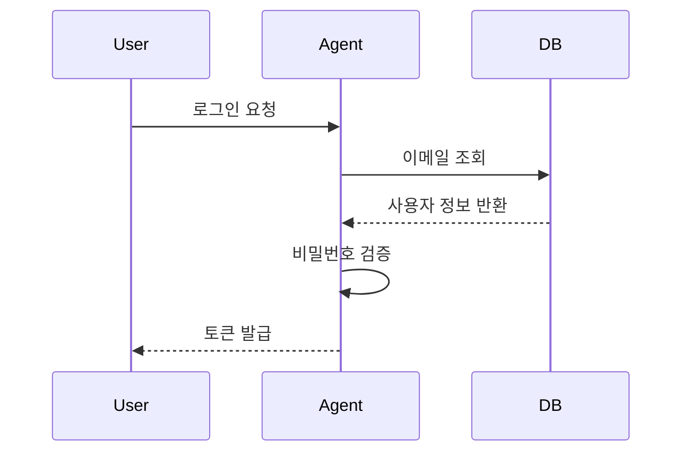

# 왜 UML을 다시 꺼내들었을까?

_written by Claude-Code, Chat_GPT_

[[ai-agent-document-types|AI Agent 소통 효율을 높이는 6가지 문서 유형]]에서 UML을 구조화 문서의 하나로 다뤘다. 이번 연재에서는 UML을 더 깊이 들여다본다. "UML을 이렇게 써야 한다"는 정답을 제시하는 게 아니라, **AI Agent를 이해하고 설계하는 과정에서 UML을 어떻게 활용할 수 있는지** 함께 탐구한다.

## 자연어 지시의 한계

"로그인 기능 만들어줘." 이 한 문장으로 AI Agent가 코드를 생성하면 어떻게 될까? Agent는 나름의 판단으로 구현하지만 결과가 기대와 다를 때가 많다.

문제는 자연어 자체의 특성이다.

- **모호성**: "로그인"이 이메일/비밀번호인지, 소셜 로그인인지, 토큰 방식인지 명확하지 않다.
- **누락**: 세션 만료 처리, 실패 횟수 제한, 비밀번호 정책 같은 세부 조건이 빠진다.
- **맥락 의존성**: "기존 방식대로"는 Agent가 추측으로 채울 수밖에 없다.

Agent는 빠진 정보를 임의로 채운다. 결과는 동작하지만, 원하던 것과 다르다. 수정이 반복된다.

UML은 이 간극을 줄인다. 구조화된 다이어그램은 의도를 시각적으로 고정하고, Agent가 추측할 여지를 없앤다.

## AI Agent가 UML을 해석하는 방식

AI Agent는 텍스트 기반으로 동작한다. 시각적인 이미지를 직접 처리하기보다 **Mermaid나 PlantUML 같은 텍스트 기반 UML 표기법**이 더 효과적이다.



이 시퀀스 다이어그램 하나가 전달하는 정보는 다음과 같다.

- 로그인의 주체와 수신자
- 처리 단계의 순서
- 각 단계의 입력과 출력
- 비밀번호 검증이 서버 내부에서 이루어진다는 사실

같은 내용을 자연어로 전달하면 누락과 모호함이 생긴다. 다이어그램은 정확하고 구조적이다.

## AI Agent 개발을 위한 UML 전체 지도

자연어 요구사항이 UML로 구조화되면, AI Agent는 이를 코드로 변환한다. 이 흐름에서 4가지 다이어그램이 각각 다른 역할을 담당한다.


각 다이어그램의 역할은 다음과 같다.

| 다이어그램 | 핵심 질문 | AI Agent에서의 활용 가능성 |
|-----------|----------|--------------------------|
| 유스케이스 | 무엇을 할 것인가? | 기능 범위와 시나리오 탐색 |
| 액티비티 | 어떤 흐름으로 처리되는가? | Agent 내부 처리 흐름 시각화 |
| 시퀀스 | 누가 누구와 상호작용하는가? | 멀티 Agent 간 메시지 흐름 표현 |
| 컴포넌트 | 시스템은 무엇으로 구성되는가? | Agent 시스템의 구조와 의존성 파악 |

### 1. 유스케이스 다이어그램 — 무엇을 할 것인가

"무엇을 만들어야 하는가"를 탐색한다. 사용자와 시스템 간의 상호작용을 기능 단위로 표현한다. 자연어로 쏟아지는 요구사항을 시각적으로 정리하면, 무엇이 포함되고 무엇이 빠졌는지가 눈에 들어온다.

### 2. 액티비티 다이어그램 — 어떤 흐름으로 처리되는가

Agent가 작업을 처리하는 흐름을 표현한다. 입력을 받아 조건을 판단하고 도구를 호출하고 결과를 반환하는 단계. 흐름이 시각화되면 어디서 분기하고 어디서 루프가 발생하는지가 드러난다.

### 3. 시퀀스 다이어그램 — 누가 누구와 상호작용하는가

멀티 Agent 환경에서 누가 누구에게 무엇을 전달하는지를 표현한다. 메시지 흐름과 응답 순서를 시각화하면, 복잡한 Agent 협업 구조를 하나의 그림으로 이해할 수 있다.

### 4. 컴포넌트 다이어그램 — 시스템은 무엇으로 구성되는가

Agent 시스템을 구성하는 컴포넌트와 그 의존성을 표현한다. 어떤 Agent가 어떤 도구와 연결되고, 외부 시스템과 어떻게 통합되는지를 한눈에 볼 수 있다.

## 어떤 순서로 탐구할 것인가

4가지 다이어그램은 독립적으로도 쓸 수 있지만, Agent 개발의 사고 흐름에 자연스러운 순서가 있다.

```
무엇을 할까?            → 유스케이스 다이어그램
어떤 흐름으로 처리될까?    → 액티비티 다이어그램
Agent끼리 어떻게 소통할까? → 시퀀스 다이어그램
시스템은 무엇으로 구성될까? → 컴포넌트 다이어그램
```

이 순서가 정답은 아니다. 작업의 성격에 따라 컴포넌트 구조부터 스케치하는 게 더 자연스러울 때도 있다. 중요한 건 각 다이어그램이 Agent 개발에서 어떤 질문을 탐구하는 도구인지 이해하는 것이다.

---

다음 편에서는 **[[uml-use-case-for-ai-agent|유스케이스 다이어그램]]** 으로 AI Agent의 요구사항을 정리하는 방법을 탐구한다.
