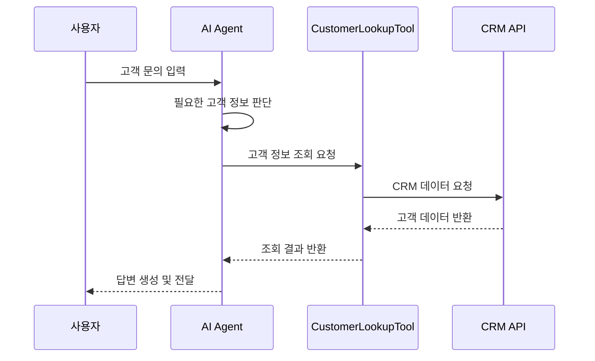
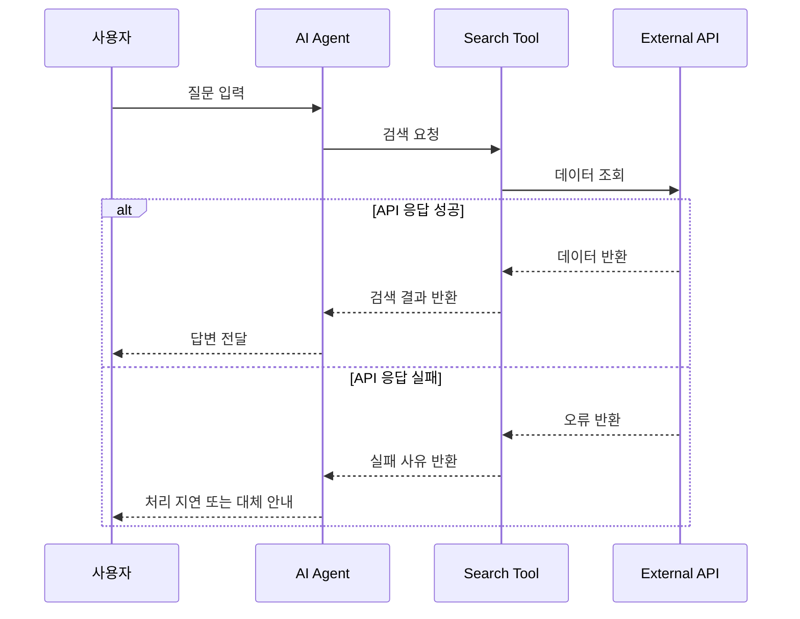
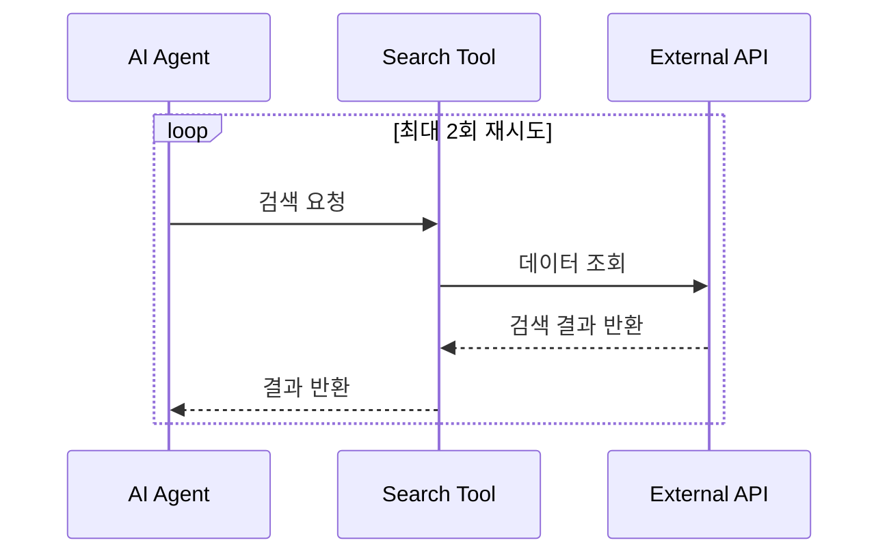
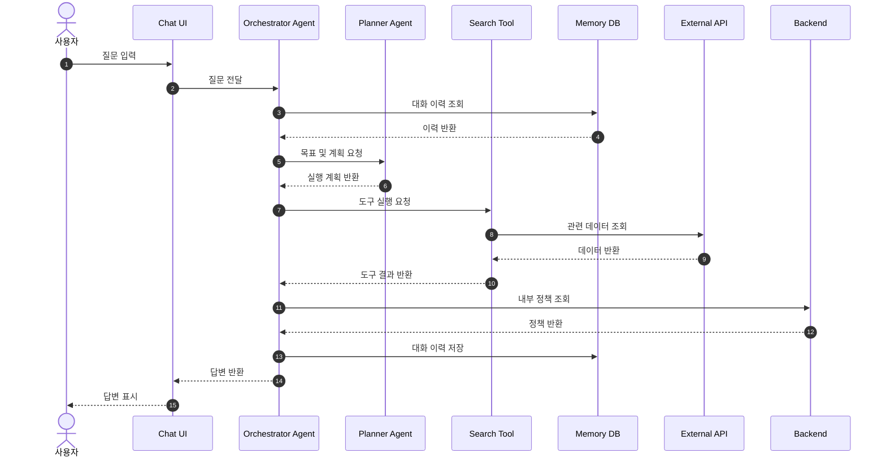
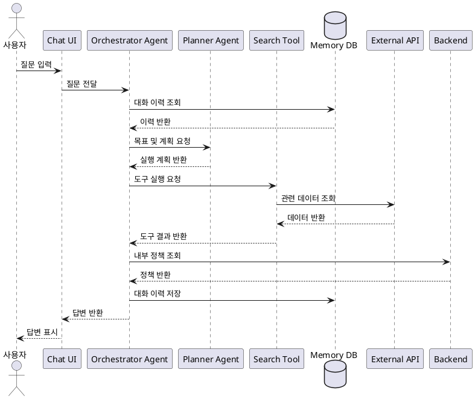

# 시퀀스 다이어그램: 누가 누구와 상호작용하는가

_written by Codex, ChatGPT_

[[uml-activity-for-ai-agent|3편: 액티비티 다이어그램]]에서는 고객 질문이 어떤 흐름으로 처리되는지 살펴봤다. 시작점, 조건 분기, 재시도, 종료 조건을 그리면 "어떤 순서로 처리되는가"가 보인다.

그 다음에는 더 구체적인 질문이 남는다.

**그 흐름 안에서 누가 누구에게 무엇을 요청하는가?**

시퀀스 다이어그램은 이 질문을 탐구하는 도구다. 액티비티 다이어그램이 처리 흐름의 지도를 그린다면, 시퀀스 다이어그램은 그 흐름 안에서 오가는 메시지를 시간 순서대로 펼친다.

## 왜 시퀀스 다이어그램인가

AI Agent 기반 기능을 만들다 보면 자연어 요구사항은 보통 이렇게 시작한다.

> 사용자가 질문하면 Agent가 필요한 도구를 호출하고, 외부 API에서 데이터를 가져와 답변을 만들어줘.

겉으로는 충분해 보인다. 하지만 구현으로 내려가면 금방 질문이 늘어난다.

- Agent가 직접 도구를 호출하는가, Planner를 거치는가?
- Memory 조회는 답변 생성 전인가, 도구 호출 전인가?
- Tool 호출과 External API 호출은 같은 계층에서 일어나는가?
- 외부 API 응답은 누구에게 돌아오는가?
- 실패했을 때 사용자에게 바로 응답하는가, 대체 도구를 다시 호출하는가?

이 질문들은 "무슨 기능을 만들 것인가"도 아니고, "전체 흐름이 어떻게 되는가"만으로도 부족하다. **참여자 사이의 호출 관계**를 봐야 답할 수 있다.

시퀀스 다이어그램은 사용자, AI Agent, Planner, Tool, Memory, External API, Backend 같은 참여자를 세로로 세우고, 그 사이의 요청과 응답을 시간 순서대로 연결한다. 그 결과 Agent가 혼자 알아서 처리한다고 뭉뚱그려졌던 부분이 여러 개의 명시적인 상호작용으로 나뉜다.

## 시퀀스 다이어그램이 보여주는 것

시퀀스 다이어그램은 시스템이 실행되는 동안 참여자들이 어떤 메시지를 주고받는지 보여준다.

| 구성 요소 | AI Agent와 함께 개발할 때의 의미 |
|-----------|--------------------------------|
| 참여자 | 사용자, Agent, Tool, Memory, API, Backend처럼 상호작용하는 주체 |
| 라이프라인 | 각 참여자가 시간 흐름 안에서 존재하는 축 |
| 메시지 | 요청, 응답, 이벤트, 데이터 전달 |
| 활성 구간 | 참여자가 실제로 처리 중인 구간 |
| 반환 메시지 | 처리 결과나 응답이 돌아오는 흐름 |
| `alt` | 조건에 따라 갈라지는 대안 흐름 |
| `opt` | 특정 조건에서만 실행되는 선택 흐름 |
| `loop` | 반복되는 호출이나 재시도 흐름 |

이 이미지의 중심에는 AI Agent가 사용자 요청을 받은 뒤 Planner, Tool, Memory, External API, Backend와 상호작용하는 흐름이 있다. 여기서 중요한 것은 "Agent가 답변한다"가 아니라, 답변이 만들어지기까지 어떤 참여자가 어떤 순서로 호출되는지를 보는 것이다.

## 예시: 고객 질문에 답변하는 AI Agent

앞선 편들과 같은 고객지원 서비스 예시를 이어서 보자. 사용자가 질문을 입력하면 AI Agent가 의도를 파악하고, 필요한 정보를 조회한 뒤 답변을 생성한다.

이 흐름을 시퀀스 관점으로 나누면 참여자는 다음과 같다.

| 참여자 | 역할 |
|--------|------|
| 사용자 | 질문을 입력하고 답변을 받는다 |
| Chat UI | 사용자 입력을 Agent에게 전달하고 결과를 표시한다 |
| Orchestrator Agent | 전체 요청을 조율한다 |
| Planner Agent | 목표를 세분화하고 실행 계획을 만든다 |
| Tool | 검색, 계산, 조회 같은 내부 도구를 실행한다 |
| Memory | 대화 이력이나 사용자 맥락을 저장하고 조회한다 |
| External API | 외부 데이터를 제공한다 |
| Backend | 내부 비즈니스 데이터와 정책을 제공한다 |

액티비티 다이어그램에서는 "도구 호출"이라는 액션 하나로 보였던 부분이, 시퀀스 다이어그램에서는 여러 메시지로 풀린다.

| 순서 | 메시지 | 확인할 질문 |
|------|--------|-------------|
| 1 | 사용자 -> Chat UI: 질문 입력 | 입력 형식은 무엇인가? 파일이나 이미지도 포함되는가? |
| 2 | Chat UI -> Orchestrator: 질문 전달 | 인증 정보나 세션 정보도 함께 전달되는가? |
| 3 | Orchestrator -> Memory: 대화 이력 조회 | 어떤 범위의 이력을 가져오는가? |
| 4 | Orchestrator -> Planner: 계획 수립 요청 | Planner가 별도 역할인가, Agent 내부 단계인가? |
| 5 | Planner -> Orchestrator: 실행 계획 반환 | 계획은 어떤 형식으로 표현되는가? |
| 6 | Orchestrator -> Tool: 도구 실행 요청 | Tool 선택 기준은 무엇인가? |
| 7 | Tool -> External API: 데이터 조회 | 외부 API 실패 시 대체 흐름이 있는가? |
| 8 | External API -> Tool: 조회 결과 반환 | 응답 스키마는 어떻게 검증하는가? |
| 9 | Orchestrator -> Backend: 정책 또는 내부 데이터 조회 | 외부 API와 내부 Backend의 책임은 분리되어 있는가? |
| 10 | Orchestrator -> Memory: 대화 이력 저장 | 저장 시점은 응답 전인가, 응답 후인가? |
| 11 | Orchestrator -> Chat UI: 답변 반환 | 근거, 출처, 신뢰도도 함께 반환하는가? |

이 표를 쓰다 보면 구현 전에는 잘 보이지 않던 설계 질문이 드러난다. "도구를 호출한다"는 말 안에는 도구 선택, 파라미터 구성, 외부 호출, 응답 검증, 실패 처리, 결과 병합이 숨어 있다.

## Agent와 Tool을 나누어 그리는 이유

AI Agent와 함께 개발할 때 가장 자주 흐려지는 경계가 Agent와 Tool 사이의 경계다.

Agent는 판단한다. 어떤 목표를 달성해야 하는지, 어떤 도구가 필요한지, 다음 단계가 무엇인지 결정한다.

Tool은 실행한다. 검색하고, 계산하고, API를 호출하고, 파일을 읽고, DB를 조회한다.

이 둘을 같은 박스에 넣으면 구현 지시가 모호해진다.

> Agent가 고객 정보를 찾아서 답변한다.

이 문장은 짧지만 책임이 섞여 있다. 시퀀스 다이어그램으로 나누면 다음처럼 바뀐다.

이렇게 쓰면 구현할 때의 경계가 달라진다. Agent 프롬프트에는 판단 기준이 들어가고, Tool에는 입력 스키마와 API 호출 로직이 들어간다. 테스트도 달라진다. Agent는 도구 선택이 맞는지 테스트하고, Tool은 API 요청과 응답 처리를 테스트한다.

## Memory는 언제 조회하고 언제 저장하는가

AI Agent 기능에서 Memory는 편리한 표현이지만, 설계에서는 반드시 시점을 정해야 한다.

- 사용자 요청을 받자마자 이전 대화 이력을 조회하는가?
- Planner가 계획을 세우기 전에 조회하는가?
- Tool 실행 결과도 Memory에 저장하는가?
- 최종 답변만 저장하는가, 중간 판단 과정도 저장하는가?

시퀀스 다이어그램은 이 질문을 숨기지 못하게 만든다. Memory가 라이프라인으로 등장하면 조회와 저장 메시지를 어느 위치에 둘지 결정해야 한다.

예를 들어 대화형 고객지원 서비스라면 일반적으로 다음 순서가 더 자연스럽다.

1. 사용자 질문을 받는다.
2. 이전 대화 이력과 사용자 맥락을 조회한다.
3. 현재 질문과 맥락을 함께 보고 계획을 세운다.
4. 도구나 API를 호출한다.
5. 최종 답변과 필요한 요약 정보를 저장한다.

물론 모든 서비스가 이 순서를 따라야 하는 것은 아니다. 중요한 것은 "Memory를 쓴다"가 아니라 "언제, 무엇을, 왜 읽고 쓰는가"를 정하는 것이다.

## `alt`, `opt`, `loop`를 어디에 쓰는가

시퀀스 다이어그램은 정상 흐름만 그릴 때 가장 쉽게 시작할 수 있다. 하지만 실제 설계에서 더 중요한 것은 정상 흐름에서 벗어나는 순간이다.

| 문법 | 쓰는 상황 | 예시 |
|------|-----------|------|
| `alt` | 조건에 따라 서로 다른 흐름으로 갈라질 때 | API 응답 성공 / 실패 |
| `opt` | 특정 조건에서만 추가 단계가 실행될 때 | 질문이 모호할 때 추가 질문 생성 |
| `loop` | 같은 흐름이 반복될 때 | 검색 결과 품질이 낮을 때 재시도 |

고객 질문 처리 흐름에 대입하면 다음처럼 표현할 수 있다.

재시도까지 포함하면 `loop`가 들어간다.

처음부터 모든 예외 흐름을 그릴 필요는 없다. 먼저 정상 흐름을 그리고, 그 다음 실패 가능성이 큰 호출에 `alt`, 조건부 단계에 `opt`, 재시도 구간에 `loop`를 붙이면 된다.

## AI Agent에게 전달할 때

이미지 다이어그램은 사람 사이의 검토에 좋다. 하지만 AI Agent에게 구현 맥락을 전달할 때는 텍스트 기반 시퀀스 다이어그램이 더 안정적이다.

Mermaid로는 다음 정도면 충분히 시작할 수 있다.

PlantUML을 선호한다면 같은 흐름을 다음처럼 전달할 수 있다.

이 코드는 단순한 그림 설명이 아니다. 구현을 맡은 Agent에게 다음 정보를 함께 넘긴다.

- 참여자와 책임 경계
- 호출 순서
- 동기 요청과 반환 흐름
- Memory 조회와 저장 시점
- 외부 API와 내부 Backend의 분리

자연어로 "흐름 잘 맞춰서 구현해줘"라고 하는 것보다 훨씬 구체적이다.

## 작성할 때 자주 생기는 실수

시퀀스 다이어그램은 메시지 흐름을 보여주는 도구다. 그래서 너무 많은 것을 한 장에 넣으면 오히려 읽기 어려워진다.

첫째, 내부 구현을 너무 자세히 넣지 않는다.

`validateInput()`, `parseJson()`, `mapResponseDto()` 같은 함수 호출을 모두 넣기 시작하면 다이어그램이 코드 추적표가 된다. 핵심은 참여자 사이의 상호작용이다. 내부 구현은 필요한 경우 별도 문서나 컴포넌트 내부 설계로 넘기는 편이 낫다.

둘째, 라이프라인을 클래스명으로만 나누지 않는다.

처음 설계할 때는 `CustomerService`, `AnswerService`보다 `AI Agent`, `Search Tool`, `Memory`, `External API`처럼 역할 기준으로 나누는 것이 이해하기 쉽다. 클래스명은 구현이 구체화된 뒤에 맞춰도 늦지 않다.

셋째, 응답 흐름을 생략하지 않는다.

요청 화살표만 있고 반환이 없으면 누가 결과를 받는지 흐려진다. 특히 Tool과 API가 섞인 구조에서는 반환 메시지를 표시해야 책임 경계가 분명해진다.

넷째, 실패 흐름을 나중에라도 추가한다.

정상 흐름만으로 시작하는 것은 괜찮다. 하지만 외부 API, DB, 권한 확인, 결제, 파일 업로드처럼 실패 가능성이 높은 지점은 `alt`나 `opt`로 보완해야 한다. 실패 흐름이 없으면 Agent는 구현 단계에서 임의의 예외 처리를 만들 가능성이 높다.

## 간단한 작성 순서

처음부터 완성된 시퀀스 다이어그램을 만들 필요는 없다. 다음 순서로 충분하다.

1. 액티비티 다이어그램에서 핵심 흐름 하나를 고른다.
2. 그 흐름에 참여하는 사용자, Agent, Tool, API, DB, Backend를 적는다.
3. 왼쪽에서 오른쪽으로 책임이 가까운 순서대로 배치한다.
4. 사용자 요청부터 최종 응답까지 정상 흐름을 먼저 연결한다.
5. 각 메시지 이름을 "무엇을 요청하는가" 기준으로 적는다.
6. 반환 메시지에 "무엇이 돌아오는가"를 적는다.
7. 실패, 조건부 실행, 반복이 필요한 곳에 `alt`, `opt`, `loop`를 추가한다.

작성 중에는 다음 질문을 계속 확인한다.

- Agent가 판단하는 지점은 어디인가?
- Tool이 실행만 담당하는 지점은 어디인가?
- 외부 API와 내부 Backend의 책임은 분리되어 있는가?
- Memory 조회와 저장 시점은 명확한가?
- 실패했을 때 사용자에게 돌아가는 메시지는 무엇인가?

이 질문에 답하다 보면 다이어그램은 자연스럽게 설계 문서가 된다.

## 이번 편의 정리

시퀀스 다이어그램은 AI Agent와 함께 시스템이나 서비스를 개발할 때 "누가 누구와 상호작용하는가"를 탐구하는 도구다.

- 참여자를 세우면 역할과 책임 경계가 보인다.
- 메시지를 연결하면 호출 순서와 데이터 흐름이 드러난다.
- 반환 메시지를 적으면 결과를 받는 주체가 명확해진다.
- `alt`, `opt`, `loop`를 추가하면 조건, 선택, 반복 흐름을 구현 전에 검토할 수 있다.

유스케이스가 만들 것의 범위를 정하고, 액티비티가 처리 흐름을 펼쳤다면, 시퀀스 다이어그램은 그 흐름 안의 대화를 정리한다. AI Agent에게 구현을 맡길 때 이 대화 흐름이 있으면 Agent가 컴포넌트 사이의 호출 관계를 덜 추측한다.

다음 편에서는 이 상호작용들이 어떤 시스템 구성 요소 위에 놓이는지 살펴본다. 질문은 자연스럽게 컴포넌트 다이어그램으로 이어진다.

---

## 시리즈 네비게이션

- **이전**: [[uml-activity-for-ai-agent|3편 - 액티비티 다이어그램: 어떤 흐름으로 처리되는가]]
- **현재**: 4편 - 시퀀스 다이어그램 (누가 누구와 상호작용하는가)
- **다음**: 5편 - 컴포넌트 다이어그램 (시스템은 무엇으로 구성되는가)

## 연관 포스트

- [[ai-agent-document-types|AI Agent 소통 효율을 높이는 6가지 문서 유형]]
- [[ai-agent-development-principles|AI Agent 개발 원칙]]
