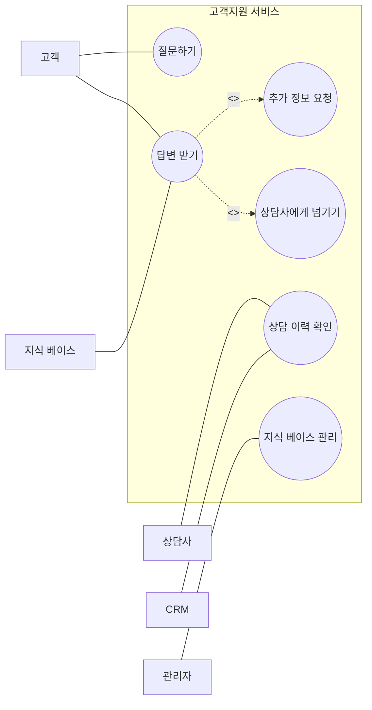

# 유스케이스 다이어그램: 무엇을 할 것인가

_written by Codex, ChatGPT_

[[uml-for-ai-agent-intro|1편: 왜 UML을 다시 꺼내들었을까?]]에서는 AI Agent와 자연어만으로 소통할 때 생기는 모호함을 이야기했다. 이번 2편에서는 시스템이나 서비스를 만들기 전에 던져야 할 첫 번째 질문을 다룬다.

**우리는 무엇을 만들 것인가?**

유스케이스 다이어그램은 이 질문에 답하기 위한 도구다. 정확히는 답을 한 번에 확정하는 도구라기보다, 만들려는 시스템이 제공해야 할 기능과 외부 세계와의 접점을 눈앞에 펼쳐 놓고 탐구하게 해주는 도구에 가깝다.

## 왜 유스케이스부터 보는가

고객지원 서비스를 만든다고 하면 먼저 기능 목록부터 쓰고 싶어진다.

> 고객 문의를 접수하고 답변을 관리하는 고객지원 서비스를 만들어줘.

하지만 기능 목록으로 바로 내려가면 금방 막힌다. 구현 전에 먼저 정리해야 할 질문이 있기 때문이다.

- 고객은 무엇을 입력할 수 있는가?
- 시스템은 언제 바로 답변을 보여주고, 언제 추가 정보를 요청해야 하는가?
- 상담사는 어디서 개입하는가?
- CRM, 지식 베이스, 티켓 시스템은 이번 서비스 안에 포함되는가, 아니면 외부 시스템인가?
- 관리자는 무엇을 설정하거나 검토할 수 있는가?

이 질문들은 아직 "어떤 흐름으로 처리되는가"가 아니다. 그건 다음 편의 액티비티 다이어그램에서 다룰 질문이다. 유스케이스 다이어그램이 먼저 붙잡는 것은 더 앞선 질문이다.

**누가 이 시스템과 상호작용하고, 그들은 무엇을 얻으려고 하는가?**

## 유스케이스 다이어그램이 보여주는 것

유스케이스 다이어그램은 시스템 내부 구현을 자세히 설명하지 않는다. 대신 시스템 바깥에서 바라본 기능 범위를 보여준다.

| 구성 요소 | AI Agent와 함께 개발할 때의 의미 |
|-----------|--------------------------------|
| 액터 | 만들려는 시스템과 상호작용하는 사람, 다른 시스템, 외부 서비스 |
| 유스케이스 | 액터가 시스템을 통해 달성하려는 목표 |
| 시스템 경계 | 이번에 만들 시스템/서비스의 안과 밖을 나누는 선 |
| 연관 | 어떤 액터가 어떤 목표를 시스템에 요청하는지 |
| `<<include>>` | 여러 목표에서 항상 반복되는 공통 기능 |
| `<<extend>>` | 특정 조건에서만 추가되는 선택 흐름 |

이 유스케이스 다이어그램을 AI Agent와의 협업에서 활용할 때, AI Agent는 정리된 요구사항을 전달받아 구현을 함께 진행하는 협업 파트너로 보면 된다. 유스케이스 다이어그램 자체가 먼저 드러내야 하는 대상은 실제 사용자, 외부 시스템, 그들이 시스템을 통해 달성하려는 목표다.

여기서 중요한 것은 유스케이스를 함수 목록처럼 쓰지 않는 것이다. `retrieveDocuments()`, `validateToken()`, `callExternalApi()`는 구현 내부 행동이다. 유스케이스 다이어그램에서는 보통 너무 낮은 수준이다.

반대로 "고객이 답변을 받는다", "상담사가 상담 이력을 확인한다", "관리자가 지식 베이스를 관리한다"처럼 외부 액터의 목표로 표현하면 만들려는 서비스의 역할이 더 선명해진다. AI Agent에게도 "이 기능을 구현해줘"보다 훨씬 안정적인 개발 맥락을 줄 수 있다.

## 예시: 고객지원 서비스를 바라보기

고객지원 서비스를 만든다고 가정해보자. 자연어 요구사항은 보통 이렇게 시작한다.

> 고객 질문을 접수하고, 지식 베이스를 검색해서 답변 후보를 만들고, 필요하면 상담사에게 넘겨줘.

이 문장을 유스케이스 관점으로 펼치면 다음과 같은 액터가 보인다.

| 액터 | 시스템과의 관계 |
|------|----------------|
| 고객 | 질문하고 답변을 받는다 |
| 상담사 | 상담 이력을 확인하고 필요할 때 개입한다 |
| 관리자 | 지식 베이스나 정책을 관리한다 |
| CRM | 고객 정보를 제공하는 외부 시스템이다 |
| 지식 베이스 | 답변 근거를 제공하는 외부 시스템이다 |

그 다음에는 각 액터의 목표를 유스케이스로 적어 본다.

| 유스케이스 | 탐구할 질문 |
|------------|-------------|
| 질문하기 | 고객은 어떤 형태로 질문하는가? 텍스트만 가능한가? 파일도 포함되는가? |
| 답변 받기 | 시스템은 어떤 조건에서 답변을 제공했다고 볼 수 있는가? 근거를 함께 보여줘야 하는가? |
| 추가 정보 요청 | 질문이 모호할 때 시스템이 고객에게 되물을 수 있는가? |
| 상담사에게 넘기기 | 어떤 상황에서 자동 응답을 멈추고 사람에게 넘기는가? |
| 상담 이력 확인 | 상담사는 시스템의 처리 과정과 답변 근거를 볼 수 있어야 하는가? |
| 지식 베이스 관리 | 관리자는 문서를 직접 수정하는가, 아니면 승인만 하는가? |

이렇게 액터와 목표를 나누어 보면, 고객, 상담사, 관리자, 외부 시스템이 고객지원 서비스와 어떻게 만나는지 보이기 시작한다. 이 순간 "이번에 만들 시스템이 맡을 일"과 "외부 시스템에 맡길 일"도 분리된다.

## `include`와 `extend`를 너무 빨리 확정하지 않기

유스케이스 다이어그램을 그릴 때 자주 헷갈리는 부분이 `<<include>>`와 `<<extend>>`다.

간단히 말하면 `<<include>>`는 항상 필요한 공통 기능이고, `<<extend>>`는 조건부로 덧붙는 흐름이다.

고객지원 서비스 예시로 보면 다음처럼 생각할 수 있다.

| 관계 | 예시 | 의미 |
|------|------|------|
| `<<include>>` | 답변 받기 -> 지식 검색 | 답변을 만들 때 근거 검색이 항상 필요하다 |
| `<<include>>` | 상담 이력 확인 -> 고객 정보 조회 | 상담 이력을 보려면 고객 식별 정보가 필요하다 |
| `<<extend>>` | 답변 받기 -> 추가 정보 요청 | 질문이 모호할 때만 추가 질문을 한다 |
| `<<extend>>` | 답변 받기 -> 상담사에게 넘기기 | 신뢰도가 낮거나 정책상 사람이 봐야 할 때만 넘긴다 |

다만 처음부터 관계를 완벽히 맞추려고 할 필요는 없다. 이 연재의 관점에서는 UML을 정답지처럼 쓰지 않는다. 먼저 액터와 목표를 꺼내고, 그 다음에 "이 기능은 항상 필요한가?", "특정 조건에서만 필요한가?"를 묻는 식으로 다듬으면 충분하다.

## AI Agent와 함께 개발할 때 주는 힌트

유스케이스 다이어그램은 코드를 바로 생성하기 위한 상세 설계가 아니다. 대신 AI Agent에게 요구사항을 전달하는 개발자에게 다음 힌트를 준다.

첫째, 도구 목록이 보인다.

CRM이 액터로 등장한다면 고객 정보 조회 도구가 필요할 수 있다. 지식 베이스가 등장한다면 검색 도구나 RAG 파이프라인이 필요할 수 있다. 알림 서비스가 등장한다면 외부 API 호출과 실패 처리도 고려해야 한다.

둘째, 권한과 책임의 경계가 보인다.

관리자가 지식 베이스를 관리한다면 시스템이 문서를 직접 바꾸는지, 변경 요청만 만드는지 정해야 한다. 상담사가 개입한다면 자동화 로직이 어디까지 판단하고 어디서 멈춰야 하는지도 정해야 한다.

셋째, 다음 다이어그램의 질문이 생긴다.

"답변 받기"라는 유스케이스를 찾았다면, 다음에는 그 안에서 어떤 흐름이 일어나는지 보고 싶어진다. 문의 접수, 분류, 지식 검색, 답변 후보 생성, 상담사 검토, 실패 처리 같은 단계가 떠오른다. 이 질문은 자연스럽게 액티비티 다이어그램으로 이어진다.

## 간단한 작성 순서

처음부터 UML 표기법을 모두 외울 필요는 없다. 다음 순서로 충분히 시작할 수 있다.

1. 만들려는 시스템/서비스 이름을 시스템 경계 안에 적는다.
2. 시스템 바깥에 사용자, 관리자, 외부 서비스를 액터로 적는다.
3. 각 액터가 시스템을 통해 얻고 싶은 목표를 동사구로 적는다.
4. 목표가 너무 구현 세부사항이면 한 단계 위로 올린다.
5. 항상 필요한 공통 기능은 `<<include>>`, 조건부 기능은 `<<extend>>` 후보로 표시한다.
6. "이번 시스템이 하지 않을 일"도 경계 밖에 남겨 둔다.

이 과정에서 중요한 것은 예쁘게 그리는 것이 아니다. 자연어 요구사항 속에 숨어 있던 역할, 목표, 경계를 드러내는 것이다.

## AI Agent에게 전달할 때

이미지로 그린 다이어그램은 사람 사이의 대화에 유용하다. 하지만 AI Agent에게 개발 맥락으로 전달할 때는 Mermaid나 PlantUML 같은 텍스트 표기가 더 다루기 쉽다. 이미지는 범위를 함께 확인하는 데 쓰고, 구현 맥락은 아래처럼 텍스트로 넘기는 식이다.

예를 들면 다음처럼 시작할 수 있다.

이 정도만 있어도 AI Agent에게 "무엇을 만들어야 하는지"를 훨씬 덜 모호하게 전달할 수 있다. 다만 여기까지는 여전히 범위의 지도다. 내부 처리 순서, 조건 분기, 반복, 실패 흐름은 아직 충분히 설명되지 않았다.

## 이번 편의 정리

유스케이스 다이어그램은 AI Agent와 함께 시스템이나 서비스를 개발할 때 "무엇을 만들 것인가"를 묻는 도구다.

- 액터를 찾으면 시스템이 만나는 외부 세계가 보인다.
- 유스케이스를 찾으면 시스템이 제공해야 할 목표가 보인다.
- 시스템 경계를 그으면 만들 일과 만들지 않을 일이 나뉜다.
- `include`와 `extend`를 살펴보면 공통 기능과 조건부 흐름이 드러난다.

이 다이어그램 하나로 구현이 끝나지는 않는다. 하지만 AI Agent에게 전달할 요구사항의 세계를 처음으로 안정된 형태로 펼쳐 놓을 수 있다. 그래서 유스케이스 다이어그램은 AI Agent와 함께 개발을 시작할 때 첫 번째 UML로 적합하다.

---

## 시리즈 네비게이션

- **이전**: [[uml-for-ai-agent-intro|1편 - 왜 UML을 다시 꺼내들었을까?]]
- **현재**: 2편 - 유스케이스 다이어그램 (무엇을 할 것인가)
- **다음**: 3편 - 액티비티 다이어그램 (어떤 흐름으로 처리되는가)

## 연관 포스트

- [[ai-agent-document-types|AI Agent 소통 효율을 높이는 6가지 문서 유형]]
- [[ai-agent-development-principles|AI Agent 개발 원칙]]
