# 앱 딥링크 기반 비밀번호 재설정 흐름

## 딥링크란?

딥링크(Deep Link)는 앱의 특정 화면으로 바로 이동시키는 URL이다.

일반 웹 URL이 브라우저를 열듯이, 딥링크는 앱을 열면서 원하는 화면까지 한 번에 진입시킨다.

```
일반 링크: https://example.com  → 브라우저 실행
딥링크:    myapp://reset?token=abc  → 앱 실행 + 재설정 화면으로 이동
```

외부(이메일, SMS, 웹)에서 앱 내부 특정 지점으로 사용자를 안내할 때 쓴다.

---

## 배경 — 왜 방식을 바꾸는가

기존에는 "임시 비밀번호"를 이메일로 발급하는 방식을 썼다. 문제가 두 가지다.

1. **보안 취약**: 임시 비밀번호가 이메일 본문에 평문으로 노출된다. 이메일이 유출되면 계정도 뚫린다.
2. **UX 나쁨**: 사용자가 임시 비밀번호로 로그인한 뒤, 다시 비밀번호를 바꿔야 하는 2단계를 거쳐야 한다.

대안은 **재설정 링크(reset link)** 방식이다. 링크를 클릭하면 앱이 열리면서 새 비밀번호 입력 화면으로 직행한다.

---

## 전체 흐름



크게 세 단계로 나뉜다.

### 1단계 — 토큰 발급

사용자가 "비밀번호 찾기"를 요청하면 서버가 처리한다.

```
POST /auth/forgot-password  { email }
→ reset_token 생성 (UUID, 만료 15~60분)
→ DB에 저장 (users 테이블 또는 별도 password_resets 테이블)
→ 이메일 발송: https://example.com/reset?token=<token>
```

토큰은 **일회용**이어야 하고, 사용 즉시 무효화해야 한다.

### 2단계 — 딥링크로 앱 열기

이메일 링크를 누르면 두 가지 경로 중 하나로 앱이 열린다.

| 방식 | 예시 | 특징 |
|------|------|------|
| **커스텀 URL 스킴** | `myapp://reset?token=abc` | 앱 설치 필수, 설정 간단 |
| **유니버설 링크 / 앱 링크** | `https://example.com/reset?token=abc` | 미설치 시 웹 폴백 가능 |

앱이 열리면 딥링크에서 `token` 값을 파싱해 새 비밀번호 입력 화면으로 이동한다.

### 3단계 — 토큰 검증 및 비밀번호 변경

```
POST /auth/reset-password  { token, new_password }
→ 서버: token 유효성 확인 (존재 여부, 만료 여부)
→ 유효하면 비밀번호 해시 갱신
→ token 삭제 (재사용 방지)
→ 200 OK → 앱: 로그인 화면으로 이동
```

---

## 서버에서 필요한 것

| 항목 | 설명 |
|------|------|
| `reset_token` 컬럼 또는 테이블 | 토큰, 이메일, 만료 시각 저장 |
| `POST /auth/forgot-password` | 토큰 생성 + 이메일 발송 |
| `POST /auth/reset-password` | 토큰 검증 + 비밀번호 변경 |

---

## 앱에서 필요한 것

- **딥링크 핸들러**: 앱 실행 시 URL에서 `token` 파싱
- **비밀번호 재설정 화면**: token을 들고 새 비밀번호 입력 후 API 호출

React Native 기준으로는 `Linking.getInitialURL()` (콜드 스타트)과 `Linking.addEventListener('url', ...)` (백그라운드 복귀) 두 경우를 모두 처리해야 한다.

---

## 핵심 요약

- 임시 비밀번호 → 보안 취약, UX 불편 → **재설정 링크로 전환**
- 링크에는 **단기 만료 일회용 토큰**이 포함된다
- 링크 클릭 → **딥링크로 앱 실행** → 토큰 검증 → 비밀번호 변경
- 서버는 토큰 저장·검증 API 2개, 앱은 딥링크 핸들러가 추가로 필요하다
